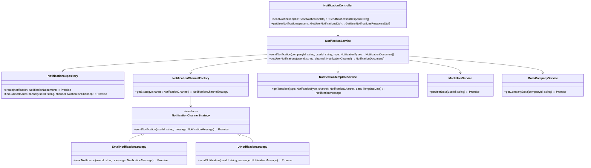

# Notification Service

## Overview

This project is a **NestJS-based Notification Service** that enables sending notifications through multiple **channels** (Email, UI) based on the predefined **notification types**. It utilizes **MongoDB** with **Mongoose** for persistence and follows **SOLID** principles with a **Strategy** and **Factory** pattern for extensibility.

## Architecture

### Key Components

- **Notification Controller:** Exposes API endpoints for sending and retrieving notifications.
- **Notification Service:** Handles the main business logic, including checking user subscriptions and sending notifications.
- **Notification Repository:** Manages interaction with MongoDB
- **Notification Channel Strategy:** Implements different notification channels such as email and UI.
- **Notification Template Service:** Generates formatted notification messages based on templates.

### Design Patterns Used

- **Factory Pattern:** Used for selecting the correct notification channel.
- **Strategy Pattern:** Each notification channel (e.g., email, UI) is implemented as a separate strategy.
- **Repository Pattern:** Handles data persistence with MongoDB

### Class Diagram



## Installation and Setup

### Prerequisites

- **Docker** and **Docker Compose** installed
- **Node.js v22+** and **npm or pnpm v10+** installed

### Running the Project

1. **Clone the repository:**
   ```sh
   git clone https://github.com/tgarif/notification-service.git
   cd notification-service
   ```
2. **Running the docker shell:**
   ```sh
   pnpm shell
   ```
   This will launch docker shell along with MongoDB. You will need to use the shell for development.
3. **Install dependencies:**
   ```sh
   pnpm install
   ```
4. **Start the application:**
   ```sh
   pnpm start
   ```
5. **Start the application in watch mode (Optional):**
   ```sh
   pnpm start:dev
   ```

### Running Tests

#### Unit Tests

Run all unit tests with:

```sh
pnpm test
```

## API Endpoints

### Send Notification

```http
POST /v1/notification/send
```

**Request Body:**

```json
{
  "companyId": "92d74381-831d-4555-8854-455ccc33ad28",
  "userId": "61f567eb-c8eb-4e4f-bee3-5dad67be4ef0",
  "type": "leave-balance-reminder"
}
```

**Response Example:**

```json
{
  "data": [
    {
      "notificationId": "67b9cc0c2fd2eeda8ff9ab6a",
      "userId": "61f567eb-c8eb-4e4f-bee3-5dad67be4ef0",
      "companyId": "92d74381-831d-4555-8854-455ccc33ad28",
      "type": "happy-birthday",
      "channel": "email",
      "content": "Ward - Jast is wishing you a happy birthday!",
      "subject": "Happy Birthday Felicita!",
      "formattedMessage": "📧 Email sent to 61f567eb-c8eb-4e4f-bee3-5dad67be4ef0 | Subject: \"Happy Birthday Felicita!\" | Content: \"Ward - Jast is wishing you a happy birthday!\"",
      "createdAt": "2025-02-22T13:07:24.254Z",
      "updatedAt": "2025-02-22T13:07:24.254Z"
    },
    {
      "notificationId": "67b9cc0c2fd2eeda8ff9ab6c",
      "userId": "61f567eb-c8eb-4e4f-bee3-5dad67be4ef0",
      "companyId": "92d74381-831d-4555-8854-455ccc33ad28",
      "type": "happy-birthday",
      "channel": "ui",
      "content": "Happy Birthday Felicita",
      "formattedMessage": "🖥️ UI notification for 61f567eb-c8eb-4e4f-bee3-5dad67be4ef0: \"Happy Birthday Felicita\"",
      "createdAt": "2025-02-22T13:07:24.258Z",
      "updatedAt": "2025-02-22T13:07:24.258Z"
    }
  ],
  "meta": {
    "requestID": "7e79639d-bed5-47bb-ba39-15b51898a1d3",
    "timestamp": "2025-02-22T13:07:24.259Z",
    "resource": "/v1/notification/send"
  }
}
```

### Get User Notifications

```http
GET /v1/notification/:userId/:channel
```

**Response Example:**

```json
{
  "data": [
    {
      "notificationId": "67b9cc0c2fd2eeda8ff9ab6c",
      "userId": "61f567eb-c8eb-4e4f-bee3-5dad67be4ef0",
      "companyId": "92d74381-831d-4555-8854-455ccc33ad28",
      "type": "happy-birthday",
      "channel": "ui",
      "content": "Happy Birthday Felicita",
      "formattedMessage": "🖥️ UI notification for 61f567eb-c8eb-4e4f-bee3-5dad67be4ef0: \"Happy Birthday Felicita\"",
      "createdAt": "2025-02-22T13:07:24.258Z",
      "updatedAt": "2025-02-22T13:07:24.258Z"
    },
    {
      "notificationId": "67b99914c4d142e41808e7fa",
      "userId": "61f567eb-c8eb-4e4f-bee3-5dad67be4ef0",
      "companyId": "92d74381-831d-4555-8854-455ccc33ad28",
      "type": "happy-birthday",
      "channel": "ui",
      "content": "Happy Birthday Taurean",
      "formattedMessage": "🖥️ UI notification for 61f567eb-c8eb-4e4f-bee3-5dad67be4ef0: \"Happy Birthday Taurean\"",
      "createdAt": "2025-02-22T09:29:56.780Z",
      "updatedAt": "2025-02-22T09:29:56.780Z"
    },
    {
      "notificationId": "67b9986cc4d142e41808e7f2",
      "userId": "61f567eb-c8eb-4e4f-bee3-5dad67be4ef0",
      "companyId": "92d74381-831d-4555-8854-455ccc33ad28",
      "type": "happy-birthday",
      "channel": "ui",
      "content": "Happy Birthday Devan",
      "formattedMessage": "🖥️ UI notification for 61f567eb-c8eb-4e4f-bee3-5dad67be4ef0: \"Happy Birthday Devan\"",
      "createdAt": "2025-02-22T09:27:08.507Z",
      "updatedAt": "2025-02-22T09:27:08.507Z"
    }
  ],
  "meta": {
    "requestID": "6642bcf0-d0ee-4244-a909-2340361e948e",
    "timestamp": "2025-02-22T13:09:03.887Z",
    "resource": "/v1/notification/61f567eb-c8eb-4e4f-bee3-5dad67be4ef0/ui"
  }
}
```
